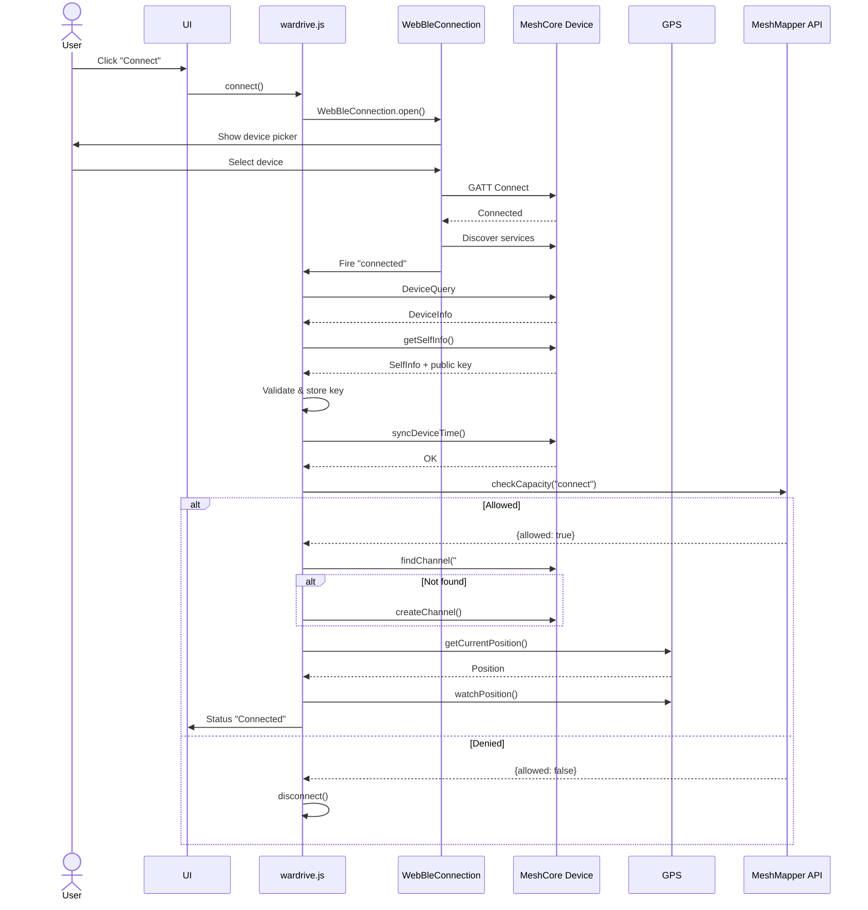
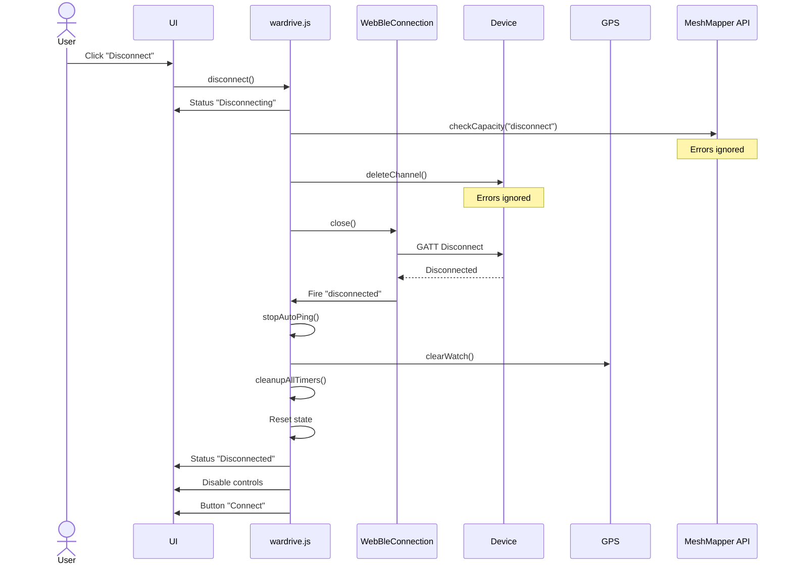
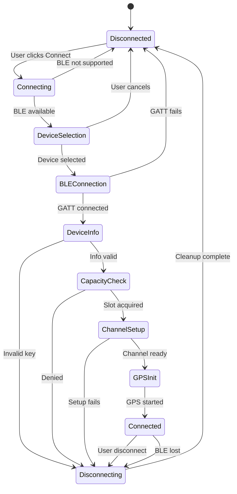

# Application Workflow Documentation

## Table of Contents
- [Overview](#overview)
  - [Connection Overview](#connection-overview)
  - [Disconnection Overview](#disconnection-overview)
- [Connection Workflow](#connection-workflow)
- [Disconnection Workflow](#disconnection-workflow)
- [Workflow Diagrams](#workflow-diagrams)
- [Code References](#code-references)
- [Edge Cases and Gotchas](#edge-cases-and-gotchas)

## Overview

### Connection Overview

**What "Connect" Means:**
- Establishes a Web Bluetooth (BLE) connection to a MeshCore companion device
- Configures the device for wardriving operations  
- Acquires an API slot from the MeshMapper backend for capacity management
- Creates or finds the `#wardriving` channel for sending GPS pings
- Initializes GPS tracking for location services
- Enables the app to send wardrive pings to the mesh network

**Connected State Enables:**
- Manual ping transmission (via "Send Ping" button)
- Automatic ping transmission (via "Start Auto Ping" with configurable intervals: 15s/30s/60s)
- GPS coordinate tracking and display
- Real-time repeater echo detection
- Integration with MeshMapper API for coverage mapping
- Session ping history logging

### Disconnection Overview

**What "Disconnect" Means:**
- Cleanly terminates the BLE connection to the MeshCore device
- Releases the API slot back to the MeshMapper backend
- Deletes the `#wardriving` channel from the device (cleanup)
- Stops all running timers and operations (auto-ping, GPS watch, wake locks)
- Clears all connection state and resets the UI
- Returns the application to idle state, ready for a new connection

**Expected App State After Disconnect:**
- Connection Status: "Disconnected" (red)
- Dynamic Status: Em dash (`—`) for normal disconnect, or error message for error disconnects
- All controls disabled except "Connect" button
- GPS tracking stopped
- Auto-ping mode disabled
- All timers cleared
- Connection state reset
- Ready to initiate a new connection

## Connection Workflow

### Connection Steps (High-Level)

1. **User Initiates** → User clicks "Connect" button
2. **Device Selection** → Browser shows BLE device picker
3. **BLE GATT Connection** → Establishes GATT connection to device
4. **Protocol Handshake** → Exchanges protocol version
5. **Device Info** → Retrieves device name, public key, settings
6. **Time Sync** → Synchronizes device clock
7. **Capacity Check** → Acquires API slot from MeshMapper
8. **Channel Setup** → Creates/finds #wardriving channel
9. **GPS Init** → Starts GPS tracking
10. **Connected** → Enables all controls, ready for wardriving

### Detailed Connection Steps

See `content/wardrive.js` lines 2020-2150 for the main `connect()` function.

**Key Entry Point:**
```javascript
connectBtn.addEventListener("click", async () => {
  if (state.connection) {
    await disconnect();
  } else {
    await connect();
  }
});
```

**Connection Sequence:**

1. **Validate Web Bluetooth Support**
   - Checks `navigator.bluetooth` exists
   - Alerts user if not supported
   - Fails fast if unavailable
   - **Connection Status**: N/A
   - **Dynamic Status**: N/A (alert shown)

2. **Open BLE Connection**
   - Calls `WebBleConnection.open()` (web_ble_connection.js:15-41)
   - Shows browser's native device picker
   - Filters for MeshCore BLE service UUID
   - User selects device or cancels
   - **Connection Status**: `"Connecting"` (blue) - remains until GPS init completes
   - **Dynamic Status**: `"—"` (em dash - cleared)

3. **Initialize BLE**
   - Connects to GATT server
   - Discovers service and characteristics (RX/TX)
   - Starts notifications on TX characteristic
   - Sets up frame listener for incoming data
   - Fires "connected" event
   - **Connection Status**: `"Connecting"` (blue, maintained)
   - **Dynamic Status**: `"—"` (em dash)

4. **Device Query**
   - Sends protocol version query
   - Non-critical, errors ignored
   - **Connection Status**: `"Connecting"` (blue, maintained)
   - **Dynamic Status**: `"—"` (em dash)

5. **Get Device Info**
   - Retrieves device name, public key (32 bytes), settings
   - **CRITICAL**: Validates public key length
   - Converts to hex string
   - Stores in `state.devicePublicKey`
   - Updates UI with device name
   - Changes button to "Disconnect" (red)
   - **Connection Status**: `"Connecting"` (blue, maintained)
   - **Dynamic Status**: `"—"` (em dash)

6. **Sync Device Time**
   - Sends current Unix timestamp
   - Device updates its clock
   - Optional, errors ignored
   - **Connection Status**: `"Connecting"` (blue, maintained)
   - **Dynamic Status**: `"—"` (em dash)

7. **Check Capacity**
   - **Connection Status**: `"Connecting"` (blue, maintained)
   - **Dynamic Status**: `"Acquiring wardriving slot"` (blue)
   - POSTs to MeshMapper API:
     ```json
     {
       "key": "API_KEY",
       "public_key": "device_hex_key",
       "who": "device_name",
       "reason": "connect"
     }
     ```
   - If `allowed: false`:
     - Sets `state.disconnectReason = "capacity_full"`
     - Triggers disconnect sequence after 1.5s delay
     - **Connection Status**: `"Connecting"` → `"Disconnecting"` → `"Disconnected"` (red)
     - **Dynamic Status**: `"Acquiring wardriving slot"` → `"WarDriving app has reached capacity"` (red, terminal)
   - If API error:
     - Sets `state.disconnectReason = "app_down"`
     - Triggers disconnect sequence after 1.5s delay (fail-closed)
     - **Connection Status**: `"Connecting"` → `"Disconnecting"` → `"Disconnected"` (red)
     - **Dynamic Status**: `"Acquiring wardriving slot"` → `"WarDriving app is down"` (red, terminal)
   - On success:
     - **Connection Status**: `"Connecting"` (blue, maintained)
     - **Dynamic Status**: `"Acquired wardriving slot"` (green)

8. **Setup Channel**
   - **Connection Status**: `"Connecting"` (blue, maintained)
   - **Dynamic Status**: `"Looking for #wardriving channel"` (blue)
   - Searches for existing `#wardriving` channel
   - If found:
     - **Dynamic Status**: `"Channel #wardriving found"` (green)
     - Stores channel object in `state.channel`
     - Updates UI: "#wardriving (CH:X)"
   - If not found:
     - **Dynamic Status**: `"Channel #wardriving not found"` (blue)
     - Creates new channel:
       - Finds empty channel slot
       - Derives channel key: `SHA-256(#wardriving).slice(0, 16)`
       - Sends setChannel command
     - **Dynamic Status**: `"Created #wardriving"` (green)
     - Stores channel object in `state.channel`
     - Updates UI: "#wardriving (CH:X)"

9. **Initialize GPS**
   - **Connection Status**: `"Connecting"` (blue, maintained)
   - **Dynamic Status**: `"Priming GPS"` (blue)
   - Requests location permission
   - Gets initial GPS position (30s timeout)
   - Starts continuous GPS watch
   - Starts GPS age updater (1s interval)
   - Starts distance updater (3s interval)
   - Updates UI with coordinates and accuracy
   - Refreshes coverage map if accuracy < 100m

10. **Connection Complete**
    - **Connection Status**: `"Connected"` (green) - **NOW shown after GPS init**
    - **Dynamic Status**: `"—"` (em dash - cleared to show empty state)
    - Enables all UI controls
    - Ready for wardriving operations

## Disconnection Workflow

### Disconnection Steps (High-Level)

1. **Disconnect Trigger** → User clicks "Disconnect" or error occurs
2. **Status Update** → Connection Status shows "Disconnecting", Dynamic Status cleared to em dash
3. **Capacity Release** → Returns API slot to MeshMapper
4. **Channel Deletion** → Removes #wardriving channel from device
5. **BLE Disconnect** → Closes GATT connection
6. **Cleanup** → Stops timers, GPS, wake locks
7. **State Reset** → Clears all connection state
8. **Disconnected** → Connection Status shows "Disconnected", Dynamic Status shows em dash or error message

### Detailed Disconnection Steps

See `content/wardrive.js` lines 2119-2179 for the main `disconnect()` function.

**Disconnect Triggers:**
- User clicks "Disconnect" button
- Capacity denial during connect
- Public key validation failure
- Channel setup failure
- BLE connection lost (device out of range)

**Disconnection Sequence:**

1. **Disable Button**
   - Prevents duplicate disconnect requests

2. **Set Disconnect Reason**
   - "normal" - user-initiated
   - "capacity_full" - MeshMapper full
   - "app_down" - API unavailable
   - "error" - validation/setup failure
   - "slot_revoked" - slot revoked during active session

3. **Update Status**
   - **Connection Status**: `"Disconnecting"` (blue) - remains until cleanup completes
   - **Dynamic Status**: `"—"` (em dash - cleared)

4. **Release Capacity**
   - POSTs to MeshMapper API with `reason: "disconnect"`
   - **Fail-open**: errors ignored, always proceeds

5. **Delete Channel**
   - Sends `setChannel(idx, "", zeros)` to clear slot
   - **Fail-open**: errors ignored, always proceeds

6. **Close BLE**
   - Tries `connection.close()`
   - Falls back to `connection.disconnect()`
   - Last resort: `device.gatt.disconnect()`
   - Triggers "gattserverdisconnected" event

7. **Disconnected Event Handler**
   - Fires on BLE disconnect
   - **Connection Status**: `"Disconnected"` (red) - ALWAYS set regardless of reason
   - **Dynamic Status**: Set based on `state.disconnectReason` (WITHOUT "Disconnected:" prefix):
     - `capacity_full` → `"WarDriving app has reached capacity"` (red)
     - `app_down` → `"WarDriving app is down"` (red)
     - `slot_revoked` → `"WarDriving slot has been revoked"` (red)
     - `public_key_error` → `"Unable to read device public key; try again"` (red)
     - `channel_setup_error` → Error message (red)
     - `ble_disconnect_error` → Error message (red)
     - `normal` / `null` / `undefined` → `"—"` (em dash)
   - Runs comprehensive cleanup:
     - Stops auto-ping mode
     - Clears auto-ping timer
     - Stops GPS watch
     - Stops GPS age updater
     - Stops distance updater
     - Stops repeater tracking
     - Clears all timers (see `cleanupAllTimers()`)
     - Releases wake lock
     - Clears connection state
     - Clears device public key

8. **UI Cleanup**
   - Disables all controls except "Connect"
   - Clears device info display
   - Clears GPS display
   - Clears distance display
   - Changes button to "Connect" (green)

9. **State Reset**
   - `state.connection = null`
   - `state.channel = null`
   - `state.lastFix = null`
   - `state.lastSuccessfulPingLocation = null`
   - `state.gpsState = "idle"`

10. **Disconnected Complete**
    - **Connection Status**: `"Disconnected"` (red)
    - **Dynamic Status**: `"—"` (em dash) or error message based on disconnect reason
    - All resources released
    - Ready for new connection

### Slot Revocation Workflow

When a wardriving slot is revoked during an active session (detected during API posting), a special disconnect sequence occurs:

**Revocation Detection:**
- Occurs during `postToMeshMapperAPI()` call (after every ping)
- API response contains `allowed: false`
- This indicates the backend has revoked the device's slot

**Revocation Sequence:**

1. **Detection**
   - During "Posting to API" operation
   - API returns `{"allowed": false, ...}`
   - Detected in `postToMeshMapperAPI()` response handler

2. **Initial Status**
   - **Dynamic Status**: `"Error: Posting to API (Revoked)"` (red)
   - Sets `state.disconnectReason = "slot_revoked"`
   - Visible for 1.5 seconds

3. **Disconnect Initiated**
   - Calls `disconnect()` after 1.5s delay
   - **Connection Status**: `"Disconnecting"` (blue)
   - **Dynamic Status**: `"—"` (em dash - cleared during disconnect)
   - Proceeds with normal disconnect cleanup

4. **Terminal Status**
   - Disconnect event handler detects `slot_revoked` reason
   - **Connection Status**: `"Disconnected"` (red)
   - **Dynamic Status**: `"WarDriving slot has been revoked"` (red, terminal - NO "Disconnected:" prefix)
   - This is the final terminal status

**Complete Revocation Flow:**
```
Connection Status: (unchanged) → "Disconnecting" → "Disconnected"
Dynamic Status: "Posting to API" → "Error: Posting to API (Revoked)" → "—" → "WarDriving slot has been revoked"
```

**Key Differences from Normal Disconnect:**
- Normal disconnect: Dynamic Status shows `"—"` (em dash)
- Revocation: Dynamic Status shows `"WarDriving slot has been revoked"` (red error, no prefix)
- Revocation shows intermediate "Error: Posting to API (Revoked)" state

## Workflow Diagrams

### Connection Sequence



### Disconnection Sequence



### State Machine



## Code References

### Connect Entry Points
- **Main function**: `wardrive.js:connect()` (lines 2002-2118)
- **Button listener**: `wardrive.js` line 2207
- **WebBLE open**: `web_ble_connection.js:WebBleConnection.open()` (lines 15-41)
- **BLE init**: `web_ble_connection.js:init()` (lines 43-77)

### Disconnect Entry Points
- **Main function**: `wardrive.js:disconnect()` (lines 2119-2179)
- **Button listener**: `wardrive.js` line 2207 (same button, checks state)
- **Auto disconnect**: triggered by capacity/validation failures
- **BLE event**: `gattserverdisconnected` (web_ble_connection.js:46)

### Key Connection Functions
- **Channel setup**: `wardrive.js:ensureChannel()` (lines 941-971)
- **Channel creation**: `wardrive.js:createWardriveChannel()` (lines 899-939)
- **Key derivation**: `wardrive.js:deriveChannelKey()` (lines 847-896)
- **GPS init**: `wardrive.js:primeGpsOnce()` (lines 804-842)
- **GPS watch**: `wardrive.js:startGeoWatch()` (lines 751-792)
- **Capacity check**: `wardrive.js:checkCapacity()` (lines 1018-1082)

### Key Disconnection Functions
- **Timer cleanup**: `wardrive.js:cleanupAllTimers()` (lines 427-460)
- **Auto-ping stop**: `wardrive.js:stopAutoPing()` (lines 1904-1934)
- **GPS watch stop**: `wardrive.js:stopGeoWatch()` (lines 793-803)
- **Repeater stop**: `wardrive.js:stopRepeaterTracking()` (lines 1506-1544)
- **Channel delete**: `connection.js:deleteChannel()` (lines 1909-1911)

### State Management
- **Global state**: `wardrive.js` lines 102-136 (`const state = {...}`)
- **Connection Status management**: `wardrive.js:setConnStatus(text, color)` - Updates connection status bar
- **Dynamic Status management**: `wardrive.js:setDynamicStatus(text, color, immediate)` - Updates dynamic status bar
- **Internal status**: `wardrive.js:setStatus()` (lines 165-225) - Internal implementation with minimum visibility
- **Button state**: `wardrive.js:setConnectButton()` (lines 495-518)
- **Control state**: `wardrive.js:enableControls()` (lines 462-466)

### Transport Implementation
- **WebBLE class**: `web_ble_connection.js` (lines 4-106)
- **Base connection**: `connection.js` (lines 9-2218)
- **Event emitter**: `events.js`
- **Constants**: `constants.js`

## Edge Cases and Gotchas

### Connect While Connected
- Button acts as toggle
- If connected, triggers disconnect
- No duplicate connections possible

### Disconnect While Connecting
- Button disabled during connect
- Only auto-disconnects possible (capacity/validation)
- GATT disconnect triggers normal cleanup

### Browser Refresh
- All state lost
- BLE connection dropped
- Session ping log cleared
- User must reconnect
- No auto-reconnect

### Network Loss
- **BLE loss**: auto-disconnect via `gattserverdisconnected`
- **API timeout (connect)**: fail-closed, deny connection
- **API timeout (disconnect)**: fail-open, allow disconnect
- **Ping API timeout**: fail-open, ping considered sent

### Reconnect Behavior
- No automatic reconnect
- User must manually click "Connect"
- Full connection sequence runs
- New capacity slot acquired
- Previous session data lost

### Resource Leaks
- Comprehensive cleanup on disconnect
- All timers tracked and cleared
- All event listeners removed
- GPS watch cleared
- Wake lock released
- **No known leaks** ✅

### Capacity Management
- **Slot exhaustion**: connect denied, user waits
- **Release failure**: disconnect proceeds anyway
- **API downtime**: connect fails (fail-closed)
- **Orphaned slots**: rely on server-side timeout

### Channel Management
- **No empty slots**: error shown, pings unavailable
- **Channel exists**: reuses existing, no warning
- **Delete failure**: logged, disconnect proceeds
- **Conflict risk**: ensure MeshCore app disconnected first

### GPS Edge Cases
- **Permission denied**: error shown, pings still work
- **Low accuracy**: allowed, map refresh skipped
- **Timeout**: watch continues, may skip auto-pings
- **Signal loss**: watch polls, old data check enforced

### Auto-Ping Interactions
- **Manual during auto**: auto pauses, resumes after
- **7s cooldown**: prevents rapid-fire pings
- **Control locking**: "Send Ping" and "Start Auto Ping" buttons remain locked for entire ping lifecycle:
  - Locked when: ping sent → listening for repeats (7s) → finalizing repeats → posting to API (3s + API time)
  - Unlocked when: API post completes or error occurs
  - Prevents starting new pings while previous ping is still processing
- **Page hidden**: auto stops, must restart manually
- **Cooldown bypass**: only on disconnect

### Error Recovery
- **Connect fails**: button re-enabled, user retries
- **Ping fails**: auto continues, no retry
- **API fails (connect)**: fail-closed, user retries
- **API fails (disconnect)**: fail-open, always succeeds

### State Consistency
- Single state object (`state`)
- No partial states
- Clear transitions
- Error → Disconnected
- Recovery always possible

## Summary

MeshCore-GOME-WarDriver implements a robust Web Bluetooth wardriving application with clear connection/disconnection workflows:

**Key Design Principles:**
1. **Fail-Closed on Connect**: API errors deny connection
2. **Fail-Open on Disconnect**: Always proceed regardless of errors
3. **Comprehensive Cleanup**: All resources explicitly released
4. **Clear State Machine**: No ambiguous states
5. **User Transparency**: Status messages at every step

**Connection:** BLE → Device Info → Time Sync → Capacity Check → Channel Setup → GPS → Connected

**Disconnection:** Capacity Release → Channel Delete → BLE Close → Full Cleanup → Disconnected

**Debug Mode:** Add `?debug=true` to URL for detailed logging

The workflow prioritizes reliability, clear error messages, and complete resource cleanup on every disconnect.
