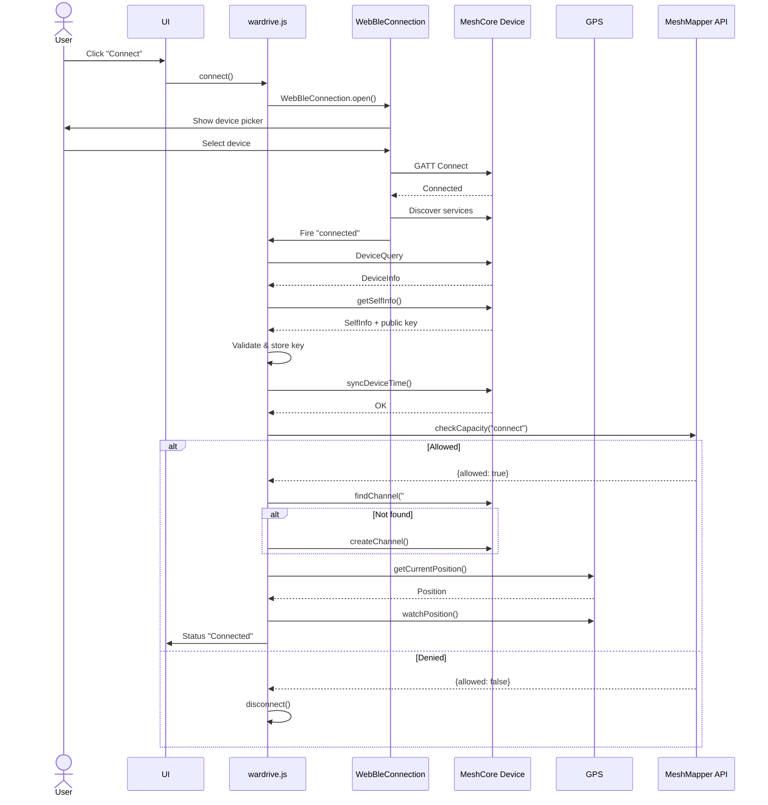
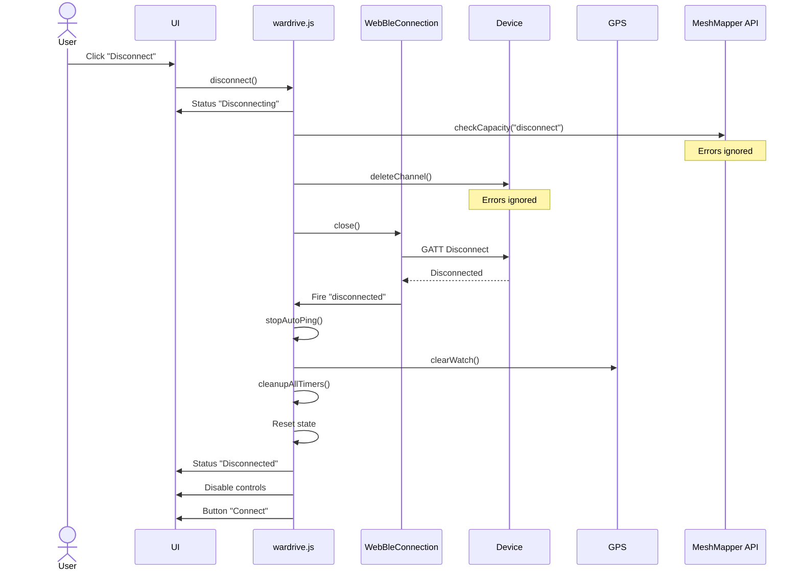
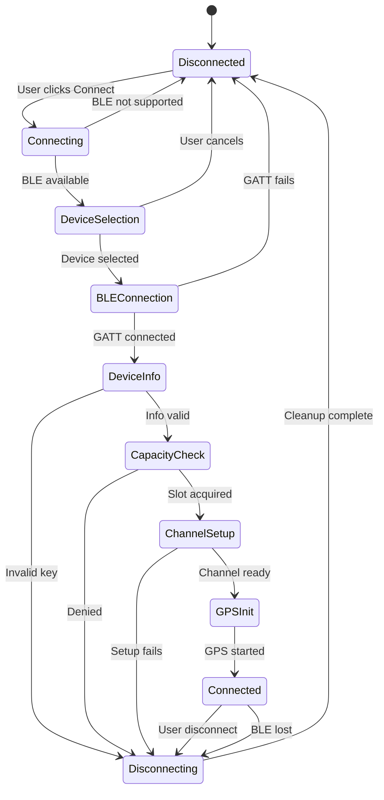

# Application Workflow Documentation

## Table of Contents
- [Overview](#overview)
  - [Connection Overview](#connection-overview)
  - [Disconnection Overview](#disconnection-overview)
- [Connection Workflow](#connection-workflow)
- [Disconnection Workflow](#disconnection-workflow)
- [Workflow Diagrams](#workflow-diagrams)
- [Code References](#code-references)
- [Edge Cases and Gotchas](#edge-cases-and-gotchas)

## Overview

### Connection Overview

**What "Connect" Means:**
- Establishes a Web Bluetooth (BLE) connection to a MeshCore companion device
- Configures the device for wardriving operations  
- Acquires an API slot from the MeshMapper backend for capacity management
- Creates or finds the `#wardriving` channel for sending GPS pings
- Initializes GPS tracking for location services
- Enables the app to send wardrive pings to the mesh network

**Connected State Enables:**
- Manual ping transmission (via "Send Ping" button)
- Automatic ping transmission (via "Start Auto Ping" with configurable intervals: 15s/30s/60s)
- GPS coordinate tracking and display
- Real-time repeater echo detection
- Integration with MeshMapper API for coverage mapping
- Session ping history logging

### Disconnection Overview

**What "Disconnect" Means:**
- Cleanly terminates the BLE connection to the MeshCore device
- Releases the API slot back to the MeshMapper backend
- Deletes the `#wardriving` channel from the device (cleanup)
- Stops all running timers and operations (auto-ping, GPS watch, wake locks)
- Clears all connection state and resets the UI
- Returns the application to idle state, ready for a new connection

**Expected App State After Disconnect:**
- Connection Status: "Disconnected" (red)
- Dynamic Status: Em dash (`—`) for normal disconnect, or error message for error disconnects
- All controls disabled except "Connect" button
- GPS tracking stopped
- Auto-ping mode disabled
- All timers cleared
- Connection state reset
- Ready to initiate a new connection

## Connection Workflow

### Connection Steps (High-Level)

1. **User Initiates** → User clicks "Connect" button
2. **Device Selection** → Browser shows BLE device picker
3. **BLE GATT Connection** → Establishes GATT connection to device
4. **Protocol Handshake** → Exchanges protocol version
5. **Device Info** → Retrieves device name, public key, settings
6. **Time Sync** → Synchronizes device clock
7. **Capacity Check** → Acquires API slot from MeshMapper
8. **Channel Setup** → Creates/finds #wardriving channel
9. **Passive RX Listening** → Starts background packet monitoring
10. **GPS Init** → Starts GPS tracking
11. **Always-On Services** → Starts background services (Map Refresh, API Queue Flush)
12. **Session Initialization** → Clears TX Log and RX Log for new session
13. **Connected** → Enables all controls, ready for wardriving

### Detailed Connection Steps

See `content/wardrive.js` lines 2020-2150 for the main `connect()` function.

**Key Entry Point:**
```javascript
connectBtn.addEventListener("click", async () => {
  if (state.connection) {
    await disconnect();
  } else {
    await connect();
  }
});
```

**Connection Sequence:**

1. **Validate Web Bluetooth Support**
   - Checks `navigator.bluetooth` exists
   - Alerts user if not supported
   - Fails fast if unavailable
   - **Connection Status**: N/A
   - **Dynamic Status**: N/A (alert shown)

2. **Open BLE Connection**
   - Calls `WebBleConnection.open()` (web_ble_connection.js:15-41)
   - Shows browser's native device picker
   - Filters for MeshCore BLE service UUID
   - User selects device or cancels
   - **Connection Status**: `"Connecting"` (blue) - remains until GPS init completes
   - **Dynamic Status**: `"—"` (em dash - cleared)

3. **Initialize BLE**
   - Connects to GATT server
   - Discovers service and characteristics (RX/TX)
   - Starts notifications on TX characteristic
   - Sets up frame listener for incoming data
   - Fires "connected" event
   - **Connection Status**: `"Connecting"` (blue, maintained)
   - **Dynamic Status**: `"—"` (em dash)

4. **Device Query**
   - Sends protocol version query
   - Non-critical, errors ignored
   - **Connection Status**: `"Connecting"` (blue, maintained)
   - **Dynamic Status**: `"—"` (em dash)

5. **Get Device Info**
   - Retrieves device name, public key (32 bytes), settings
   - **CRITICAL**: Validates public key length
   - Converts to hex string
   - Stores in `state.devicePublicKey`
   - Updates UI with device name
   - Changes button to "Disconnect" (red)
   - **Connection Status**: `"Connecting"` (blue, maintained)
   - **Dynamic Status**: `"—"` (em dash)

6. **Sync Device Time**
   - Sends current Unix timestamp
   - Device updates its clock
   - Optional, errors ignored
   - **Connection Status**: `"Connecting"` (blue, maintained)
   - **Dynamic Status**: `"—"` (em dash)

7. **Check Capacity**
   - **Connection Status**: `"Connecting"` (blue, maintained)
   - **Dynamic Status**: `"Acquiring wardriving slot"` (blue)
   - POSTs to MeshMapper API:
     ```json
     {
       "key": "API_KEY",
       "public_key": "device_hex_key",
       "who": "device_name",
       "reason": "connect"
     }
     ```
   - If `allowed: false` with reason code:
     - API response may include `reason` field: `{"allowed": false, "reason": "outofdate"}`
     - If reason code exists in `REASON_MESSAGES` mapping:
       - Sets `state.disconnectReason = data.reason` (e.g., "outofdate")
       - Triggers disconnect sequence after 1.5s delay
       - **Connection Status**: `"Connecting"` → `"Disconnecting"` → `"Disconnected"` (red)
       - **Dynamic Status**: `"Acquiring wardriving slot"` → `"[mapped message]"` (red, terminal)
       - Example: "App out of date, please update" for reason="outofdate"
     - If reason code not in mapping:
       - Sets `state.disconnectReason = data.reason`
       - Shows fallback message: "Connection not allowed: [reason]"
     - If no reason code provided (backward compatibility):
       - Sets `state.disconnectReason = "capacity_full"`
       - **Dynamic Status**: `"MeshMapper at capacity"` (red, terminal)
   - If API error:
     - Sets `state.disconnectReason = "app_down"`
     - Triggers disconnect sequence after 1.5s delay (fail-closed)
     - **Connection Status**: `"Connecting"` → `"Disconnecting"` → `"Disconnected"` (red)
     - **Dynamic Status**: `"Acquiring wardriving slot"` → `"MeshMapper unavailable"` (red, terminal)
   - On success:
     - **Connection Status**: `"Connecting"` (blue, maintained)
     - **Dynamic Status**: `"Acquired wardriving slot"` (green)

8. **Setup Channel**
   - **Connection Status**: `"Connecting"` (blue, maintained)
   - **Dynamic Status**: `"Looking for #wardriving channel"` (blue)
   - Searches for existing `#wardriving` channel
   - If found:
     - **Dynamic Status**: `"Channel #wardriving found"` (green)
     - Stores channel object in `state.channel`
     - Updates UI: "#wardriving (CH:X)"
   - If not found:
     - **Dynamic Status**: `"Channel #wardriving not found"` (blue)
     - Creates new channel:
       - Finds empty channel slot
       - Derives channel key: `SHA-256(#wardriving).slice(0, 16)`
       - Sends setChannel command
     - **Dynamic Status**: `"Created #wardriving"` (green)
     - Stores channel object in `state.channel`
     - Updates UI: "#wardriving (CH:X)"

9. **Start Passive RX Listening**
   - **Connection Status**: `"Connecting"` (blue, maintained)
   - **Dynamic Status**: No user-facing message (background operation)
   - Registers event handler for `LogRxData` events
   - Begins monitoring all incoming packets on wardriving channel
   - Extracts last hop (direct repeater) from each packet
   - Records observations: repeater ID, SNR, GPS location, timestamp
   - Populates RX Log UI with real-time observations
   - Operates independently of active ping operations
   - **Debug Logging**: `[PASSIVE RX]` prefix for all debug messages

10. **Initialize GPS**
    - **Connection Status**: `"Connecting"` (blue, maintained)
    - **Dynamic Status**: `"Priming GPS"` (blue)
    - Requests location permission
    - Gets initial GPS position (30s timeout)
    - Starts continuous GPS watch
    - Starts GPS age updater (1s interval)
    - Starts distance updater (3s interval)
    - Updates UI with coordinates and accuracy
    - Refreshes coverage map if accuracy < 100m

11. **Start Always-On Background Services**
    - **Map Refresh Service**: Refreshes coverage map every 5s or when user moves 25m
    - **API Queue Flush Timer**: Flushes queued messages at war-drive interval (15s/30s/60s)
    - These services run continuously until disconnect
    - GPS Watch: Already running from step 10, continues to provide location data
    - RX Listening: Already running from step 9, continues to monitor mesh traffic
    - **Debug Logging**: `[MAP]` and `[API QUEUE]` prefixes

12. **Session Initialization**
    - Clears TX Log (Session Log) for new wardrive session
    - Clears RX Log (Passive observations) for new session
    - Preserves previous session data is lost
    - **Debug Logging**: `[TX LOG]` and `[RX LOG]` prefixes

13. **Connection Complete**
    - **Connection Status**: `"Connected"` (green) - **NOW shown after GPS init**
    - **Dynamic Status**: `"—"` (em dash - cleared to show empty state)
    - Enables all UI controls
    - Ready for wardriving operations
    - All always-on services running in background

## Disconnection Workflow

### Disconnection Steps (High-Level)

1. **Disconnect Trigger** → User clicks "Disconnect" or error occurs
2. **Status Update** → Connection Status shows "Disconnecting", Dynamic Status cleared to em dash
3. **Stop Active Modes** → Stop TX/RX Auto or RX Auto if running
4. **Stop Always-On Services** → Stop Map Refresh and RX Listening
5. **API Queue Flush** → **CRITICAL: Flush pending messages BEFORE capacity release (session_id still valid)**
6. **Stop Flush Timer** → Stop periodic flush timer
7. **Capacity Release** → Returns API slot to MeshMapper
8. **Channel Deletion** → Removes #wardriving channel from device
9. **BLE Disconnect** → Closes GATT connection
10. **Cleanup** → Stops timers, GPS, wake locks, clears queue
11. **State Reset** → Clears all connection state
12. **Disconnected** → Connection Status shows "Disconnected", Dynamic Status shows em dash or error message
13. **Session Preservation** → TX Log and RX Log preserved for user review

### Detailed Disconnection Steps

See `content/wardrive.js` for the main `disconnect()` function.

**Disconnect Triggers:**
- User clicks "Disconnect" button
- Capacity denial during connect
- Public key validation failure
- Channel setup failure
- BLE connection lost (device out of range)
- Slot revocation during active session

**Disconnection Sequence:**

1. **Disable Button**
   - Prevents duplicate disconnect requests

2. **Set Disconnect Reason**
   - "normal" - user-initiated
   - "capacity_full" - MeshMapper full (no reason code)
   - "app_down" - API unavailable
   - "error" - validation/setup failure
   - "slot_revoked" - slot revoked during active session
   - API reason codes (e.g., "outofdate") - specific denial reasons from capacity check API

3. **Update Status**
   - **Connection Status**: `"Disconnecting"` (blue) - remains until cleanup completes
   - **Dynamic Status**: `"—"` (em dash - cleared)

4. **Flush API Queue (CRITICAL - NEW)**
   - **Connection Status**: `"Disconnecting"` (maintained)
   - **Dynamic Status**: `"Posting X to API"` (if messages pending)
   - Flushes all pending TX and RX messages in queue
   - **Must occur BEFORE capacity release** (session_id still valid)
   - Waits for flush to complete (async operation)
   - Debug: `[API QUEUE] Flushing N queued messages before disconnect`

5. **Stop Flush Timers**
   - Stops 30-second periodic flush timer
   - Stops TX-triggered 3-second flush timer
   - Debug: `[API QUEUE] Stopping all flush timers`

6. **Release Capacity**
   - POSTs to MeshMapper API with `reason: "disconnect"`
   - **Fail-open**: errors ignored, always proceeds

7. **Delete Channel**
   - Sends `setChannel(idx, "", zeros)` to clear slot
   - **Fail-open**: errors ignored, always proceeds

8. **Close BLE**
   - Tries `connection.close()`
   - Falls back to `connection.disconnect()`
   - Last resort: `device.gatt.disconnect()`
   - Triggers "gattserverdisconnected" event

9. **Disconnected Event Handler**
   - Fires on BLE disconnect
   - **Connection Status**: `"Disconnected"` (red) - ALWAYS set regardless of reason
   - **Dynamic Status**: Set based on `state.disconnectReason` (WITHOUT "Disconnected:" prefix):
     - API reason codes in `REASON_MESSAGES` (e.g., `outofdate` → `"App out of date, please update"`) (red)
     - `capacity_full` → `"MeshMapper at capacity"` (red)
     - `app_down` → `"MeshMapper unavailable"` (red)
     - `slot_revoked` → `"MeshMapper slot revoked"` (red)
     - `public_key_error` → `"Device key error - reconnect"` (red)
     - `session_id_error` → `"Session error - reconnect"` (red)
     - `channel_setup_error` → Error message (red)
     - `ble_disconnect_error` → Error message (red)
     - `normal` / `null` / `undefined` → `"—"` (em dash)
     - Unknown reason codes → `"Connection not allowed: [reason]"` (red)
   - Runs comprehensive cleanup:
     - Stops auto-ping mode
     - Clears auto-ping timer
     - Stops GPS watch
     - Stops GPS age updater
     - Stops distance updater
     - Stops repeater tracking
     - **Stops passive RX listening** (unregisters LogRxData handler)
     - **Clears API queue messages** (timers already stopped)
     - Clears all timers (see `cleanupAllTimers()`)
     - Releases wake lock
     - Clears connection state
     - Clears device public key

10. **UI Cleanup**
    - Disables all controls except "Connect"
    - Clears device info display
    - Clears GPS display
    - Clears distance display
    - Changes button to "Connect" (green)

11. **State Reset**
    - `state.connection = null`
    - `state.channel = null`
    - `state.lastFix = null`
    - `state.lastSuccessfulPingLocation = null`
    - `state.gpsState = "idle"`

12. **Disconnected Complete**
    - **Connection Status**: `"Disconnected"` (red)
    - **Dynamic Status**: `"—"` (em dash) or error message based on disconnect reason
    - All resources released
    - Ready for new connection

### Slot Revocation Workflow

When a wardriving slot is revoked during an active session (detected during API posting), a special disconnect sequence occurs:

**Revocation Detection:**
- Occurs during `postToMeshMapperAPI()` call (after every ping)
- API response contains `allowed: false`
- This indicates the backend has revoked the device's slot

**Revocation Sequence:**

1. **Detection**
   - During background API POST operation (runs asynchronously after RX window)
   - API returns `{"allowed": false, ...}`
   - Detected in `postToMeshMapperAPI()` response handler

2. **Initial Status**
   - **Dynamic Status**: `"Error: Posting to API (Revoked)"` (red)
   - Sets `state.disconnectReason = "slot_revoked"`
   - Visible for 1.5 seconds
   - **Note**: User may already be seeing "Idle" or "Waiting for next ping" before this error appears (because API runs in background)

3. **Disconnect Initiated**
   - Calls `disconnect()` after 1.5s delay
   - **Connection Status**: `"Disconnecting"` (blue)
   - **Dynamic Status**: `"—"` (em dash - cleared during disconnect)
   - Proceeds with normal disconnect cleanup

4. **Terminal Status**
   - Disconnect event handler detects `slot_revoked` reason
   - **Connection Status**: `"Disconnected"` (red)
   - **Dynamic Status**: `"MeshMapper slot revoked"` (red, terminal - NO "Disconnected:" prefix)
   - This is the final terminal status

**Complete Revocation Flow (Updated for background API posting):**
```
Connection Status: (unchanged) → "Disconnecting" → "Disconnected"
Dynamic Status: "Idle"/"Waiting for next ping" → "API post failed (revoked)" → "—" → "MeshMapper slot revoked"
```
**Timeline:**
- T+0s: RX window completes, status shows "Idle" or "Waiting for next ping", next timer starts
- T+0-3s: Background API post running (3s delay, then POST) - silent
- T+3-4s: Revocation detected, "API post failed (revoked)" shown (1.5s)
- T+4.5s: Disconnect initiated
- T+5s: Terminal status "MeshMapper slot revoked"

**Key Differences from Normal Disconnect:**
- Normal disconnect: Dynamic Status shows `"—"` (em dash)
- Revocation: Dynamic Status shows `"MeshMapper slot revoked"` (red error, no prefix)
- Revocation shows intermediate "API post failed (revoked)" state
- With the new ping/repeat flow, revocation may be detected after user already sees "Idle" or "Waiting for next ping" (because API runs in background)

## Workflow Diagrams

### Connection Sequence



### Disconnection Sequence



### State Machine



## Code References

### Connect Entry Points
- **Main function**: `wardrive.js:connect()` (lines 2002-2118)
- **Button listener**: `wardrive.js` line 2207
- **WebBLE open**: `web_ble_connection.js:WebBleConnection.open()` (lines 15-41)
- **BLE init**: `web_ble_connection.js:init()` (lines 43-77)

### Disconnect Entry Points
- **Main function**: `wardrive.js:disconnect()` (lines 2119-2179)
- **Button listener**: `wardrive.js` line 2207 (same button, checks state)
- **Auto disconnect**: triggered by capacity/validation failures
- **BLE event**: `gattserverdisconnected` (web_ble_connection.js:46)

### Key Connection Functions
- **Channel setup**: `wardrive.js:ensureChannel()` (lines 941-971)
- **Channel creation**: `wardrive.js:createWardriveChannel()` (lines 899-939)
- **Key derivation**: `wardrive.js:deriveChannelKey()` (lines 847-896)
- **GPS init**: `wardrive.js:primeGpsOnce()` (lines 804-842)
- **GPS watch**: `wardrive.js:startGeoWatch()` (lines 751-792)
- **Capacity check**: `wardrive.js:checkCapacity()` (lines 1018-1082)

### Key Disconnection Functions
- **Timer cleanup**: `wardrive.js:cleanupAllTimers()` (lines 427-460)
- **Auto-ping stop**: `wardrive.js:stopAutoPing()` (lines 1904-1934)
- **GPS watch stop**: `wardrive.js:stopGeoWatch()` (lines 793-803)
- **Repeater stop**: `wardrive.js:stopRepeaterTracking()` (lines 1506-1544)
- **Channel delete**: `connection.js:deleteChannel()` (lines 1909-1911)

### State Management
- **Global state**: `wardrive.js` lines 102-136 (`const state = {...}`)
- **Connection Status management**: `wardrive.js:setConnStatus(text, color)` - Updates connection status bar
- **Dynamic Status management**: `wardrive.js:setDynamicStatus(text, color, immediate)` - Updates dynamic status bar
- **Internal status**: `wardrive.js:setStatus()` (lines 165-225) - Internal implementation with minimum visibility
- **Button state**: `wardrive.js:setConnectButton()` (lines 495-518)
- **Control state**: `wardrive.js:enableControls()` (lines 462-466)

### Transport Implementation
- **WebBLE class**: `web_ble_connection.js` (lines 4-106)
- **Base connection**: `connection.js` (lines 9-2218)
- **Event emitter**: `events.js`
- **Constants**: `constants.js`

## Edge Cases and Gotchas

### Connect While Connected
- Button acts as toggle
- If connected, triggers disconnect
- No duplicate connections possible

### Disconnect While Connecting
- Button disabled during connect
- Only auto-disconnects possible (capacity/validation)
- GATT disconnect triggers normal cleanup

### Browser Refresh
- All state lost
- BLE connection dropped
- Session ping log cleared
- User must reconnect
- No auto-reconnect

### Network Loss
- **BLE loss**: auto-disconnect via `gattserverdisconnected`
- **API timeout (connect)**: fail-closed, deny connection
- **API timeout (disconnect)**: fail-open, allow disconnect
- **Ping API timeout**: fail-open, ping considered sent

### Reconnect Behavior
- No automatic reconnect
- User must manually click "Connect"
- Full connection sequence runs
- New capacity slot acquired
- Previous session data lost

### Resource Leaks
- Comprehensive cleanup on disconnect
- All timers tracked and cleared
- All event listeners removed
- GPS watch cleared
- Wake lock released
- **No known leaks** ✅

### Capacity Management
- **Slot exhaustion**: connect denied, user waits
- **Release failure**: disconnect proceeds anyway
- **API downtime**: connect fails (fail-closed)
- **Orphaned slots**: rely on server-side timeout

### Channel Management
- **No empty slots**: error shown, pings unavailable
- **Channel exists**: reuses existing, no warning
- **Delete failure**: logged, disconnect proceeds
- **Conflict risk**: ensure MeshCore app disconnected first

### GPS Edge Cases
- **Permission denied**: error shown, pings still work
- **Low accuracy**: allowed, map refresh skipped
- **Timeout**: watch continues, may skip auto-pings
- **Signal loss**: watch polls, old data check enforced

### Auto-Ping Interactions
- **Manual during auto**: auto pauses, resumes after
- **7s cooldown**: prevents rapid-fire pings
- **Control locking**: "Send Ping" and "Start Auto Ping" buttons remain locked for entire ping lifecycle:
  - Locked when: ping sent → listening for repeats (7s) → finalizing repeats → posting to API (3s + API time)
  - Unlocked when: API post completes or error occurs
  - Prevents starting new pings while previous ping is still processing
- **Page hidden**: auto stops, must restart manually
- **Cooldown bypass**: only on disconnect

### Error Recovery
- **Connect fails**: button re-enabled, user retries
- **Ping fails**: auto continues, no retry
- **API fails (connect)**: fail-closed, user retries
- **API fails (disconnect)**: fail-open, always succeeds

### State Consistency
- Single state object (`state`)
- No partial states
- Clear transitions
- Error → Disconnected
- Recovery always possible

## Ping/Repeat Listener Flow

### Overview

The ping/repeat listener flow manages the complete lifecycle of a wardrive ping operation, from sending the ping to listening for repeater echoes to posting data to the MeshMapper API.

**Key Design Change (v1.4.2+):** API posting now runs in the background (asynchronously) to prevent blocking the main ping cycle. This allows the next ping timer to start immediately after the RX listening window completes, without waiting for the API POST to finish.

### New Ping/Repeat Flow (v1.4.2+)

```
┌─────────────────────────────────────────────────────────────────────┐
│ 1. Ping Sent                                                        │
│    - Send ping to mesh network                                      │
│    - Start repeater echo tracking                                   │
│    - Show "Ping sent" status                                        │
│    - Lock ping controls                                             │
└──────────────────────────────┬──────────────────────────────────────┘
                               │
                               ▼
┌─────────────────────────────────────────────────────────────────────┐
│ 2. RX Listening Window (10 seconds)                                 │
│    - Listen for repeater echoes                                     │
│    - Show "Listening for heard repeats (Xs)" countdown              │
│    - Track all repeaters that forward the ping                      │
│    - Update session log in real-time                                │
└──────────────────────────────┬──────────────────────────────────────┘
                               │
                               ▼
┌─────────────────────────────────────────────────────────────────────┐
│ 3. RX Window Complete - IMMEDIATE ACTIONS                           │
│    - Stop RX listening countdown                                    │
│    - Finalize heard repeats (stop tracking)                         │
│    - Update UI log with final repeater data                         │
│    - **Unlock ping controls** ← NEW: Don't wait for API             │
│    - **Start next ping timer** ← NEW: Don't wait for API            │
│    - **Set status to "Idle"/"Waiting for next ping"**               │
└──────────────────────────────┬──────────────────────────────────────┘
                               │
                               ▼
┌─────────────────────────────────────────────────────────────────────┐
│ 4. Background API Posting (Async, Non-Blocking)                     │
│    - Delay 3 seconds (silent, no status message)                    │
│    - POST ping data to MeshMapper API                               │
│    - **Success**: Silent (no UI notification)                       │
│    - **Error**: Show "Error: API post failed"                       │
│    - Refresh coverage map after POST completes                      │
└─────────────────────────────────────────────────────────────────────┘
```

### Key Changes from Previous Flow (v1.4.1 and earlier)

**Old Flow:**
1. Ping sent
2. Listen for repeats (7 seconds)
3. **Wait for API post to complete** (3s delay + POST time)
4. **Then** unlock controls and start next timer
5. Status: "Ping sent" → "Listening (7s)" → "Posting to API" → "Idle"/"Waiting"

**New Flow:**
1. Ping sent
2. Listen for repeats (10 seconds) ← **Increased from 7s to 10s**
3. **Immediately** unlock controls and start next timer ← **Key change**
4. **Background** API post (silent on success, error only if fails)
5. Status: "Ping sent" → "Listening (10s)" → "Idle"/"Waiting" ← **No "Posting to API"**

### Benefits

1. **Faster cycle times**: Next ping can start immediately after 10s RX window, not waiting for API
2. **Better UX**: User sees smooth progression without API delays blocking the UI
3. **More repeater data**: 10-second listen window (vs 7s) captures more mesh echoes
4. **Cleaner UI**: API success messages suppressed, only errors shown
5. **Non-blocking**: API failures don't stall the ping cycle

### Implementation Details

**Functions:**
- `postApiInBackground(lat, lon, accuracy, heardRepeats)` - New async function for background API posting
- `sendPing(manual)` - Refactored to start next timer immediately after RX window
- `RX_LOG_LISTEN_WINDOW_MS` - Increased from 7000ms to 10000ms

**Error Handling:**
- API POST failures are caught with `.catch()` handler
- Error message shown to user: "Error: API post failed"
- Main ping cycle continues unaffected by API failures
- Background failures don't crash or stall the application

**Debug Logging:**
- `[DEBUG] Backgrounding API post for coordinates: ...`
- `[DEBUG] Starting 3-second delay before API POST`
- `[DEBUG] 3-second delay complete, posting to API`
- `[DEBUG] Background API post completed successfully`
- `[DEBUG] Background API post failed: ...`

### Status Message Behavior

**Visible to User:**
- "Ping sent" (500ms minimum)
- "Listening for heard repeats (10s)" (countdown, 10 seconds)
- "Idle" or "Waiting for next ping (Xs)" (immediately after RX window)
- "Error: API post failed" (only if background API fails)

**Not Visible (Suppressed):**
- ~~"Posting to API"~~ - No longer shown for successful API posts
- API success confirmation - Silent operation

### Timing Analysis

**Total time from ping to next ping (Auto mode, 30s interval):**
- Old flow: 10s (ping) + 7s (listen) + 3s (delay) + 0.5s (API) + 30s (interval) = ~50.5s between pings
- New flow: 10s (ping) + 10s (listen) + 30s (interval) = ~50s between pings (API runs in parallel)

**Actual improvement:** Next timer starts ~3.5s earlier (no waiting for API), better responsiveness

## Passive RX Log Listening

### Overview

The passive RX log listening feature monitors all incoming packets on the wardriving channel without adding any traffic to the mesh network. This provides visibility into which repeaters can be heard at the current GPS location.

### Key Differences: Active Ping Tracking vs Passive RX Listening

**Active Ping Tracking (Existing):**
- Triggered when user sends a ping
- Validates incoming packets are echoes of our specific ping message
- Extracts **first hop** (first repeater in the path)
- Tracks repeaters that first forwarded our message into the mesh
- Runs for 7 seconds after each ping
- Results shown in Session Log

**Passive RX Listening (New):**
- Runs continuously in background once connected
- Monitors **all** packets on wardriving channel (not just our pings)
- Extracts **last hop** (repeater that directly delivered packet to us)
- Shows which repeaters we can actually hear from current location
- No time limit - runs entire connection duration
- Results shown in RX Log UI section

### Path Interpretation

For a packet with path: `77 → 92 → 0C`
- **First hop (ping tracking)**: `77` - origin repeater that first flooded our message
- **Last hop (passive RX)**: `0C` - repeater that directly delivered the packet to us

The last hop is more relevant for coverage mapping because it represents the repeater we can actually receive signals from at our current GPS coordinates.

### Implementation Details

**Startup:**
1. Connection established
2. Channel setup completes
3. `startPassiveRxListening()` called
4. Registers handler for `Constants.PushCodes.LogRxData` events
5. Handler: `handlePassiveRxLogEvent()`

**Packet Processing:**
1. Parse packet from raw bytes
2. Validate header (0x15 - GroupText/Flood)
3. Validate channel hash matches wardriving channel
4. Check path length (skip if no repeaters)
5. Extract last hop from path
6. Get current GPS coordinates
7. Record observation: `{repeaterId, snr, lat, lon, timestamp}`
8. Update RX Log UI

**Shutdown:**
1. Disconnect initiated
2. `stopPassiveRxListening()` called in disconnect cleanup
3. Unregisters LogRxData event handler
4. Clears state

### UI Components

**RX Log Section** (below Session Log):
- Header bar showing observation count and last repeater
- Expandable/collapsible panel
- Scrollable list of observations (newest first)
- Each entry shows: timestamp, GPS coords, repeater ID, SNR chip
- Max 100 entries (oldest removed when limit reached)

### Future API Integration

Placeholder function `postRxLogToMeshMapperAPI()` ready for future implementation:
- Batch post accumulated observations
- Include session_id from capacity check
- Format: `{observations: [{repeaterId, snr, lat, lon, timestamp}]}`
- API endpoint: `MESHMAPPER_RX_LOG_API_URL` (currently null)

### Debug Logging

All passive RX operations use `[PASSIVE RX]` prefix:
- `[PASSIVE RX] Starting passive RX listening`
- `[PASSIVE RX] Received rx_log entry: SNR=X`
- `[PASSIVE RX] Header validation passed`
- `[PASSIVE RX] Observation logged: repeater=XX`
- `[PASSIVE RX UI] Summary updated: N observations`

Enable debug mode with URL parameter: `?debug=true`

### Coexistence with Active Ping Tracking

Both handlers listen to the same `LogRxData` event simultaneously:
- **Active handler**: Validates message content matches our ping, extracts first hop
- **Passive handler**: Processes all messages, extracts last hop
- No conflicts - they serve different purposes and operate independently
- Event system supports multiple handlers on the same event

## API Batch Queue System

### Overview

The batch queue system optimizes network efficiency by batching multiple API messages into a single POST request. The MeshMapper API accepts arrays of up to 50 messages (both TX and RX types) in a single request.

**Key Benefits:**
- Reduces network overhead (fewer HTTP requests)
- Optimizes bandwidth usage
- Supports mixed TX/RX batches
- Maintains data integrity with proper flush sequencing

### Queue Configuration

**Constants:**
```javascript
const API_BATCH_MAX_SIZE = 50;              // Maximum messages per batch POST
const API_BATCH_FLUSH_INTERVAL_MS = 30000;  // Flush every 30 seconds
const API_TX_FLUSH_DELAY_MS = 3000;         // Flush 3 seconds after TX ping
```

**Queue State:**
```javascript
const apiQueue = {
  messages: [],           // Array of pending payloads
  flushTimerId: null,     // Timer ID for periodic flush (30s)
  txFlushTimerId: null,   // Timer ID for TX-triggered flush (3s)
  isProcessing: false     // Lock to prevent concurrent flush operations
};
```

### Flush Triggers

The queue flushes when ANY of these conditions are met:

1. **TX Ping Queued** → Starts/resets 3-second timer, flushes when timer fires
2. **30 Seconds Elapsed** → Periodic flush of any pending messages
3. **Queue Size Reaches 50** → Immediate flush (prevents exceeding API limit)
4. **Disconnect Called** → Flushes before releasing capacity slot

### Message Flow

**TX Messages (Active Pings):**
1. User sends ping via `sendPing()`
2. After RX listening window, `postApiAndRefreshMap()` called
3. Builds payload and calls `queueApiMessage(payload, "TX")`
4. Starts/resets TX flush timer (3 seconds)
5. Status shows: `"Queued (X/50)"`

**RX Messages (Passive Observations):**
1. Passive RX listener detects repeater
2. Batch aggregation logic processes observation
3. Calls `queueApiPost(entry)` which calls `queueApiMessage(payload, "RX")`
4. Rides along with TX flushes or 30-second periodic flush
5. Status shows: `"Queued (X/50)"`

**Batch Flush:**
1. Flush trigger fires (TX timer, periodic, size limit, or disconnect)
2. `flushApiQueue()` takes all messages from queue
3. Prevents concurrent flushes with `isProcessing` lock
4. POSTs entire batch as JSON array to API
5. Logs TX/RX counts: `[API QUEUE] Batch composition: X TX, Y RX`
6. Checks for slot revocation in response
7. Status shows: `"Posting X to API"`

### Implementation Functions

**Core Functions:**
- `queueApiMessage(payload, wardriveType)` - Add message to queue
- `scheduleTxFlush()` - Schedule 3-second flush after TX
- `startFlushTimer()` - Start 30-second periodic timer
- `stopFlushTimers()` - Stop all flush timers
- `flushApiQueue()` - Flush all queued messages
- `getQueueStatus()` - Get queue status for debugging

**Integration Points:**
- `postApiAndRefreshMap()` - Queues TX messages (replaces direct POST)
- `queueApiPost()` - Queues RX messages (replaces direct POST)
- `disconnect()` - Flushes queue BEFORE capacity release
- `cleanupAllTimers()` - Stops flush timers
- Disconnected event handler - Clears queue messages

### Error Handling

**Session ID Validation:**
- Queue functions validate `state.wardriveSessionId` before operations
- Missing session_id triggers error and disconnect

**Slot Revocation:**
- API response checked for `allowed: false`
- If revoked, triggers disconnect sequence
- Status: `"Error: Posting to API (Revoked)"`

**Network Errors:**
- Flush failures logged but don't crash app
- Status: `"Error: API batch post failed"`
- Queue continues accepting new messages

### Debug Logging

All queue operations use `[API QUEUE]` prefix:
- `[API QUEUE] Queueing TX message`
- `[API QUEUE] Queue size: X/50`
- `[API QUEUE] Scheduling TX flush in 3000ms`
- `[API QUEUE] Batch composition: X TX, Y RX`
- `[API QUEUE] Batch post successful: X TX, Y RX`

Enable debug mode with URL parameter: `?debug=true`

### Critical Disconnect Sequence

**Order matters for data integrity:**

1. **Flush queue** (session_id still valid) ← CRITICAL FIRST STEP
2. Stop flush timers
3. Release capacity slot
4. Delete channel
5. Close BLE
6. Clear queue messages
7. Cleanup and reset

This ensures all pending messages are posted before the session becomes invalid.

## Summary

MeshCore-GOME-WarDriver implements a robust Web Bluetooth wardriving application with clear connection/disconnection workflows:

**Key Design Principles:**
1. **Fail-Closed on Connect**: API errors deny connection
2. **Fail-Open on Disconnect**: Always proceed regardless of errors
3. **Comprehensive Cleanup**: All resources explicitly released
4. **Clear State Machine**: No ambiguous states
5. **User Transparency**: Status messages at every step
6. **Passive Background Monitoring**: Continuous RX logging without mesh traffic

**Connection:** BLE → Device Info → Time Sync → Capacity Check → Channel Setup → Passive RX Start → GPS → Connected

**Disconnection:** Capacity Release → Channel Delete → BLE Close → Full Cleanup (including Passive RX Stop) → Disconnected

**Debug Mode:** Add `?debug=true` to URL for detailed logging (including `[PASSIVE RX]` messages)

The workflow prioritizes reliability, clear error messages, complete resource cleanup on every disconnect, and non-intrusive background observation of mesh network activity.
