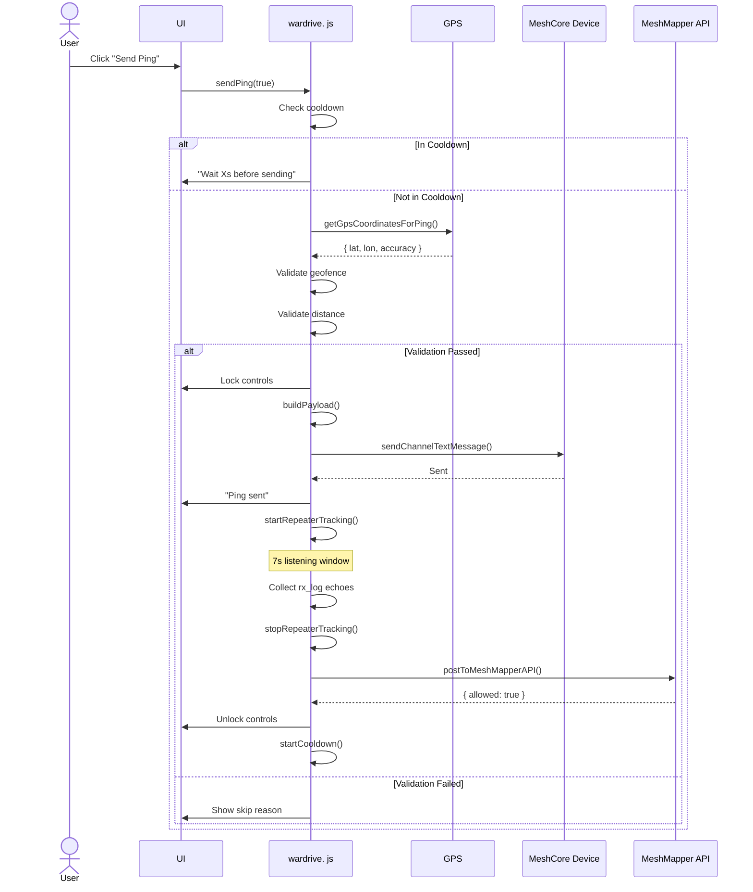
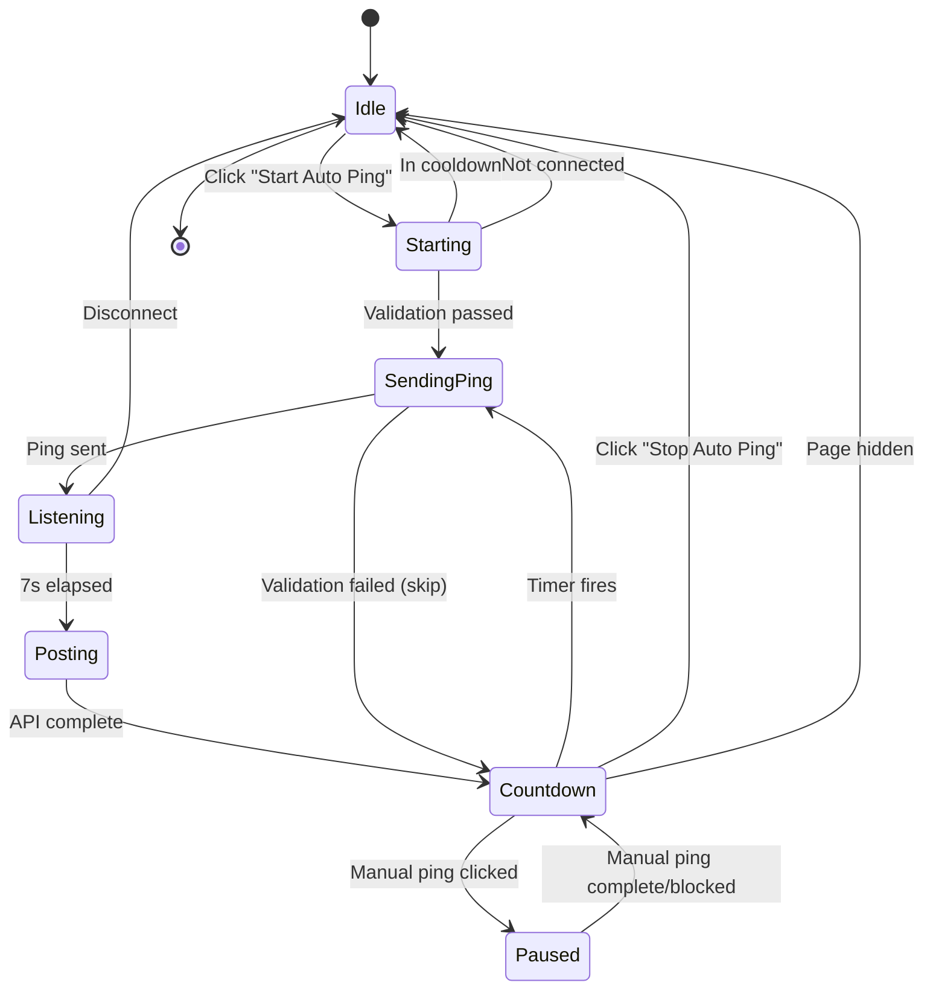

# Ping Workflow Documentation

## Table of Contents
- [Overview](#overview)
  - [Ping Overview](#ping-overview)
  - [Auto Ping Overview](#auto-ping-overview)
- [Manual Ping Workflow](#manual-ping-workflow)
- [Auto Ping Workflow](#auto-ping-workflow)
- [Ping Lifecycle](#ping-lifecycle)
- [Workflow Diagrams](#workflow-diagrams)
- [Code References](#code-references)
- [Edge Cases and Gotchas](#edge-cases-and-gotchas)

## Overview

### Ping Overview

**What a "Ping" Does:**
- Sends a wardrive ping to the mesh network via the `#wardriving` channel
- Payload format: `@[MapperBot] <LAT>, <LON>[ [power] ]`
- Triggers a 7-second RX listening window for repeater echo detection
- Posts ping data to MeshMapper API after the listening window completes
- Logs the ping in the session log with timestamp, coordinates, and repeater data

**Ping Requirements:**
- Active BLE connection to a MeshCore device
- Valid GPS coordinates (within acceptable accuracy threshold)
- Within geofenced region (Ottawa 150km)
- Minimum 25 meters from last successful ping location
- Not in cooldown period (7 seconds after previous ping)
- No ping currently in progress

### Auto Ping Overview

**What "Auto Ping" Does:**
- Automatically sends pings at configurable intervals (15s/30s/60s)
- Acquires a wake lock to keep the screen awake
- Displays countdown timer between pings
- Skips pings that fail validation (GPS, geofence, distance) without stopping
- Pauses countdown when manual ping is triggered during auto mode

**Auto Ping State:**
- `state.running`: Boolean indicating if auto mode is active
- `state.autoTimerId`: Timer ID for next scheduled ping
- `state.nextAutoPingTime`: Timestamp when next auto ping will fire
- `state.skipReason`: Reason if last ping was skipped (for countdown display)

## Manual Ping Workflow

### Manual Ping Steps (High-Level)

1. **User Initiates** → User clicks "Send Ping" button
2. **Cooldown Check** → Verify not in 7-second cooldown period
3. **GPS Acquisition** → Get current GPS coordinates
4. **Geofence Validation** → Verify location is within Ottawa 150km
5. **Distance Validation** → Verify ≥25m from last successful ping
6. **Control Lock** → Lock ping controls for entire ping lifecycle
7. **Payload Build** → Format ping message with coordinates and power
8. **Channel Send** → Send payload to `#wardriving` channel
9. **Repeater Tracking** → Start 7-second RX listening window
10. **API Post** → Post to MeshMapper API after listening window
11. **Control Unlock** → Unlock ping controls

### Detailed Manual Ping Steps

See `content/wardrive. js` lines 2211-2407 for the main `sendPing()` function.

**Key Entry Point:**
```javascript
sendPingBtn.addEventListener("click", () => {
  debugLog("Manual ping button clicked");
  sendPing(true).catch(console.error);
});
```

**Manual Ping Sequence:**

1. **Cooldown Check**
   - Checks `isInCooldown()` - compares `state.cooldownEndTime` to current time
   - If in cooldown: 
     - Shows remaining seconds
     - **Dynamic Status**:  `"Wait Xs before sending another ping"` (yellow)
     - Returns early, no ping sent
   - If not in cooldown:  proceeds

2. **Handle Auto Mode Interaction**
   - If auto mode is running (`state.running === true`):
     - Calls `pauseAutoCountdown()` to pause the auto timer
     - Stores remaining time in `state.pausedAutoTimerRemainingMs`
     - **Dynamic Status**: `"Sending manual ping"` (blue)

3. **GPS Coordinate Acquisition**
   - Calls `getGpsCoordinatesForPing(false)` for manual pings
   - For manual pings:  uses GPS watch data with 60s max age tolerance
   - If GPS unavailable:
     - **Dynamic Status**: `"Waiting for GPS fix"` (yellow)
     - Calls `handleManualPingBlockedDuringAutoMode()` to resume auto countdown
     - Returns early
   - On success: returns `{ lat, lon, accuracy }`

4. **Geofence Validation**
   - Calls `validateGeofence(lat, lon)`
   - Checks if coordinates within Ottawa 150km radius
   - If outside: 
     - Sets `state.skipReason = "outside geofence"`
     - **Dynamic Status**: `"Ping skipped, outside of geofenced region"` (yellow)
     - Calls `handleManualPingBlockedDuringAutoMode()`
     - Returns early

5. **Distance Validation**
   - Calls `validateMinimumDistance(lat, lon)`
   - Checks if ≥25m from `state.lastSuccessfulPingLocation`
   - If too close:
     - Sets `state.skipReason = "too close"`
     - **Dynamic Status**: `"Ping skipped, too close to last ping"` (yellow)
     - Calls `handleManualPingBlockedDuringAutoMode()`
     - Returns early

6. **Lock Ping Controls**
   - Sets `state.pingInProgress = true`
   - Calls `updateControlsForCooldown()` to disable buttons
   - **Dynamic Status**: `"Sending manual ping"` (blue) - if not already set

7. **Build Payload**
   - Calls `buildPayload(lat, lon)`
   - Format: `@[MapperBot] <LAT>, <LON>[ [power] ]`
   - Power suffix only included if power setting selected
   - Example: `@[MapperBot] 45.42153, -75.69719 [22]`

8. **Ensure Channel**
   - Calls `ensureChannel()` to verify `#wardriving` channel exists
   - Uses cached `state.channel` if available

9. **Capture Coordinates**
   - Stores coordinates in `state.capturedPingCoords`
   - Used for API post after 7-second delay

10. **Send to Mesh Network**
    - Calls `connection.sendChannelTextMessage(ch, payload)`
    - Fires the GroupText packet to the channel
    - **Dynamic Status**: `"Ping sent"` (green)

11. **Start Repeater Tracking**
    - Calls `startRepeaterTracking(payload, channelIdx)`
    - Registers `LogRxData` event handler for rx_log entries
    - Initializes `state.repeaterTracking` with sent payload and timestamp
    - **Dynamic Status**: `"Listening (Xs)"` (blue) - countdown display

12. **7-Second Listening Window**
    - `RX_LOG_LISTEN_WINDOW_MS = 7000`
    - Listens for repeater echoes via rx_log events
    - Each echo validated:  header check, channel hash check, payload match
    - Deduplicates by path, keeps highest SNR value
    - Updates session log with live repeater data

13. **Finalize Repeaters**
    - Calls `stopRepeaterTracking()` after 7s
    - Returns array of `{ repeaterId, snr }` objects
    - Formats as:  `"4e(11. 5),77(9.75)"` or `"None"`

14. **Post to MeshMapper API**
    - Calls `postToMeshMapperAPI(lat, lon, heardRepeats)`
    - **Dynamic Status**: `"Posting to API"` (blue)
    - Payload includes: lat, lon, who, power, heard_repeats, ver, iata, session_id
    - Validates `allowed` field in response
    - If `allowed:  false`: triggers slot revocation disconnect

15. **Refresh Coverage Map**
    - Calls `refreshCoverageMap()` after 1-second delay
    - Only if GPS accuracy < 100m

16. **Update State**
    - Stores `{ lat, lon }` in `state.lastSuccessfulPingLocation`
    - Starts cooldown period (`startCooldown()`)

17. **Unlock Ping Controls**
    - Calls `unlockPingControls()`
    - Sets `state.pingInProgress = false`
    - Updates button disabled states
    - **Dynamic Status**: `"—"` (em dash) or countdown if auto mode running

18. **Resume Auto Countdown (if applicable)**
    - If manual ping during auto mode:  calls `resumeAutoCountdown()`
    - Resumes countdown from `state.pausedAutoTimerRemainingMs`

## Auto Ping Workflow

### Auto Ping Start Sequence

1. **User Initiates** → User clicks "Start Auto Ping" button
2. **Connection Check** → Verify BLE connection exists
3. **Cooldown Check** → Verify not in cooldown period
4. **Timer Cleanup** → Clear any existing auto-ping timer
5. **GPS Watch Start** → Start continuous GPS watching
6. **State Update** → Set `state.running = true`
7. **Button Update** → Change button to "Stop Auto Ping" (amber)
8. **Wake Lock** → Acquire screen wake lock
9. **Initial Ping** → Send first ping immediately

### Detailed Auto Ping Start

See `content/wardrive.js` lines 2462-2501 for `startAutoPing()`.

**Start Entry Point:**
```javascript
autoToggleBtn.addEventListener("click", () => {
  debugLog("Auto toggle button clicked");
  if (state.running) {
    stopAutoPing();
    setDynamicStatus("Auto mode stopped", STATUS_COLORS.idle);
  } else {
    startAutoPing();
  }
});
```

**Start Sequence:**

1. **Validate Connection**
   - Checks `state.connection` exists
   - If not connected:  shows alert, returns early

2. **Cooldown Check**
   - Checks `isInCooldown()`
   - If in cooldown: 
     - **Dynamic Status**: `"Wait Xs before toggling auto mode"` (yellow)
     - Returns early

3. **Cleanup Existing Timer**
   - Clears `state.autoTimerId` if exists
   - Stops any running countdown display

4. **Clear Skip Reason**
   - Sets `state.skipReason = null`

5. **Start GPS Watch**
   - Calls `startGeoWatch()` for continuous GPS updates

6. **Update State**
   - Sets `state.running = true`
   - Calls `updateAutoButton()` to change button appearance

7. **Acquire Wake Lock**
   - Calls `acquireWakeLock()` to prevent screen sleep

8. **Send Initial Ping**
   - Calls `sendPing(false)` immediately
   - First ping does not wait for interval

### Auto Ping Stop Sequence

See `content/wardrive. js` lines 2408-2436 for `stopAutoPing()`.

1. **Cooldown Check (optional)**
   - If `stopGps` is false: checks cooldown
   - If in cooldown:  shows warning, returns early
   - `stopGps = true` bypasses cooldown check (for disconnect/page hidden)

2. **Clear Timer**
   - Clears `state.autoTimerId`
   - Stops countdown display

3. **Clear State**
   - Sets `state.skipReason = null`
   - Sets `state.pausedAutoTimerRemainingMs = null`

4. **Stop GPS Watch (conditional)**
   - Only if `stopGps = true` (disconnect or page hidden)
   - Normal stop keeps GPS watch running

5. **Update State**
   - Sets `state.running = false`
   - Calls `updateAutoButton()` to change button appearance

6. **Release Wake Lock**
   - Calls `releaseWakeLock()`

### Auto Ping Scheduling

See `content/wardrive.js` lines 2438-2459 for `scheduleNextAutoPing()`.

**After each ping (successful or skipped):**

1. **Check Running State**
   - If `state.running === false`: returns early

2. **Get Interval**
   - Calls `getSelectedIntervalMs()` (15000, 30000, or 60000)

3. **Start Countdown Display**
   - Calls `startAutoCountdown(intervalMs)`
   - Displays countdown in dynamic status
   - Shows skip reason if previous ping was skipped

4. **Schedule Timer**
   - Sets `state.autoTimerId = setTimeout(... )`
   - On timer fire: clears skip reason, calls `sendPing(false)`

### Auto Ping During Manual Ping Interaction

When user sends a manual ping while auto mode is running: 

1. **Pause Auto Countdown**
   - `pauseAutoCountdown()` saves remaining time
   - Stores in `state.pausedAutoTimerRemainingMs`

2. **Execute Manual Ping**
   - Full manual ping sequence runs

3. **Resume or Reschedule**
   - If manual ping succeeds: `scheduleNextAutoPing()` (fresh interval)
   - If manual ping blocked: `resumeAutoCountdown()` (resume from paused time)

## Ping Lifecycle

### Control Locking

Ping controls are locked for the **entire ping lifecycle**: 

```
Locked at: sendPing() validation pass
├── Send ping to mesh
├── 7-second RX listening window
├── Finalize repeater data
├── Post to MeshMapper API
└── Unlocked at: API post completes (success or error)
```

**State Variables:**
- `state.pingInProgress`: Boolean flag for active ping operation
- `state.cooldownEndTime`: Timestamp when cooldown ends
- Controls: "Send Ping" and "Start/Stop Auto Ping" buttons

### Cooldown Period

- **Duration**: 7 seconds (`COOLDOWN_MS = 7000`)
- **Starts**: After ping sent to mesh (not after API post)
- **Blocks**: Manual pings and auto mode toggle
- **Does NOT block**: Scheduled auto pings (they bypass cooldown)

### Repeater Tracking

**Listening Window:**
- Duration: 7 seconds (`RX_LOG_LISTEN_WINDOW_MS = 7000`)
- Triggered by:  Successful ping send to mesh

**Echo Validation Steps:**
1. Header validation: expects `0x15` for GroupText packets
2. Channel hash validation: compares to pre-computed `#wardriving` hash
3. Payload match: validates message content matches sent ping
4. Origin validation: verifies repeater path signature

**Deduplication:**
- Key:  Repeater path (hex string of public key prefix)
- Value: `{ snr, seenCount }`
- If duplicate path:  keeps higher SNR value

### API Posting

**Timing:**
- Occurs after 7-second RX listening window
- Before control unlock

**Payload:**
```json
{
  "key": "API_KEY",
  "lat": 45.42153,
  "lon": -75.69719,
  "who": "device_name",
  "power": "22",
  "heard_repeats": "4e(11.5),77(9.75)",
  "ver": "1.0.0",
  "iata": "YOW",
  "session_id": "uuid"
}
```

**Slot Revocation:**
- If API returns `allowed: false`:
  - Sets `state.disconnectReason = "slot_revoked"`
  - **Dynamic Status**: `"Error: Posting to API (Revoked)"` (red)
  - Triggers disconnect after 1. 5s delay

## Workflow Diagrams

### Manual Ping Sequence



### Auto Ping State Machine



### Auto Ping Countdown Flow

```mermaid
flowchart TD
    A[Ping Complete/Skipped] --> B{Auto mode running?}
    B -->|No| C[End]
    B -->|Yes| D[scheduleNextAutoPing]
    D --> E[Start countdown display]
    D --> F[Schedule timer]
    
    E --> G{Skip reason set?}
    G -->|Yes| H[Show:  "Countdown (skipped:  reason)"]
    G -->|No| I[Show: "Countdown (Xs)"]
    
    F --> J{Timer fires}
    J --> K[Clear skip reason]
    K --> L[sendPing(false)]
    L --> M{Validation}
    M -->|Pass| N[Execute ping]
    M -->|Fail| O[Set skip reason]
    N --> A
    O --> A
```

## Code References

### Ping Entry Points
- **Main function**: `wardrive.js:sendPing()` (lines 2211-2407)
- **Manual button listener**: `wardrive.js` line 2808
- **Auto button listener**: `wardrive.js` line 2812

### Auto Ping Functions
- **Start function**: `wardrive.js:startAutoPing()` (lines 2462-2501)
- **Stop function**: `wardrive.js:stopAutoPing()` (lines 2408-2436)
- **Schedule next**: `wardrive.js:scheduleNextAutoPing()` (lines 2438-2459)
- **Button update**: `wardrive.js:updateAutoButton()` (lines 539-549)

### Validation Functions
- **GPS acquisition**: `wardrive.js:getGpsCoordinatesForPing()` (lines 2036-2123)
- **Geofence check**: `wardrive.js:validateGeofence()` (called in sendPing)
- **Distance check**: `wardrive.js:validateMinimumDistance()` (called in sendPing)
- **Cooldown check**: `wardrive.js:isInCooldown()` (lines 445-447)

### Repeater Tracking
- **Start tracking**: `wardrive.js:startRepeaterTracking()` (lines 1508-1567)
- **Stop tracking**: `wardrive.js:stopRepeaterTracking()` (lines 1697-1737)
- **Handle rx_log**: `wardrive.js:handleRxLogEvent()` (lines 1569-1695)
- **Format telemetry**: `wardrive.js:formatRepeaterTelemetry()` (lines 1739-1750)

### API Functions
- **Post ping data**: `wardrive.js:postToMeshMapperAPI()` (lines 1246-1323)
- **Refresh map**: `wardrive.js:refreshCoverageMap()` (called after API post)

### Control Management
- **Lock/unlock controls**: `wardrive.js:updateControlsForCooldown()` (lines 468-473)
- **Unlock helper**: `wardrive.js:unlockPingControls()` (lines 478-482)
- **Cooldown start**: `wardrive.js:startCooldown()` (lines 454-466)

### Countdown Timers
- **Auto countdown start**: `wardrive.js:startAutoCountdown()` (lines 366-369)
- **Auto countdown stop**: `wardrive.js:stopAutoCountdown()` (lines 371-374)
- **Pause countdown**: `wardrive.js:pauseAutoCountdown()` (lines 376-392)
- **Resume countdown**: `wardrive.js:resumeAutoCountdown()` (lines 394-410)
- **RX listening countdown**: `wardrive.js:startRxListeningCountdown()` (lines 433-437)

### Payload Construction
- **Build payload**: `wardrive.js:buildPayload()` (lines 1136-1141)
- **Get interval**: `wardrive.js:getSelectedIntervalMs()` (lines 1113-1118)
- **Get power setting**: `wardrive.js:getCurrentPowerSetting()` (lines 1131-1134)

### Constants
- `COOLDOWN_MS = 7000` - Cooldown period for manual ping and auto toggle
- `RX_LOG_LISTEN_WINDOW_MS = 7000` - Repeater echo listening duration (defined as MESHMAPPER_DELAY_MS)
- `GPS_FRESHNESS_BUFFER_MS = 5000` - Buffer for GPS freshness checks
- `GPS_ACCURACY_THRESHOLD_M = 100` - Maximum acceptable GPS accuracy
- `GPS_WATCH_MAX_AGE_MS = 60000` - Maximum age for manual ping GPS data
- `MIN_PAUSE_THRESHOLD_MS = 1000` - Minimum timer value to pause

## Edge Cases and Gotchas

### Manual Ping During Auto Mode
- Auto countdown **pauses** when manual ping is initiated
- If manual ping **succeeds**:  fresh interval starts from zero
- If manual ping **blocked**: countdown **resumes** from paused time
- Prevents double-pings and maintains timing consistency

### Ping Control Locking
- Controls locked for **entire ping lifecycle** (not just mesh send)
- Includes:  ping send → 7s listening → repeaters finalize → API post
- Prevents starting new pings while previous is still processing
- Unlocked only after API post completes or error occurs

### Cooldown vs Control Lock
- **Cooldown**: 7-second period after ping sent, blocks manual pings and auto toggle
- **Control Lock**: `pingInProgress` flag, blocks all ping operations during lifecycle
- Both must be false for controls to be enabled
- Cooldown starts at ping send, control lock ends at API complete

### Auto Ping Skipping
- Auto pings that fail validation are **skipped**, not stopped
- Skip reasons:  "gps too old", "outside geofence", "too close"
- Countdown continues to next interval with skip message displayed
- Auto mode only stops on:  user action, page hidden, disconnect

### GPS Data Freshness
- **Auto pings**: require GPS data within `interval + 5000ms`
- **Manual pings**: allow GPS data up to 60 seconds old
- If GPS too old during auto:  attempts refresh, skips if fails
- GPS watch continues during auto mode, provides fresh data

### Page Visibility
- When page becomes hidden during auto mode: 
  - Auto mode stops immediately
  - GPS watch stops
  - Wake lock released
  - **Dynamic Status**: `"Lost focus, auto mode stopped"` (yellow)
- User must manually restart auto mode when returning

### Repeater Tracking Edge Cases
- **No repeaters heard**: `heard_repeats = "None"` in API post
- **Duplicate paths**: higher SNR value retained
- **Concurrent pings**: previous tracking stopped, new one starts
- **Disconnect during tracking**: tracking stops, no API post

### Error Recovery
- **GPS timeout**: ping skipped, auto continues
- **Channel send fails**: error logged, controls unlocked
- **API post fails**: logged but ping considered sent (fail-open)
- **API slot revoked**: disconnect triggered

### State Consistency
- `state.pingInProgress` prevents concurrent ping operations
- `state.capturedPingCoords` preserves coordinates for delayed API post
- `state.lastSuccessfulPingLocation` only updated after full success
- All state cleared on disconnect via `cleanupAllTimers()`

## Summary

MeshCore-GOME-WarDriver implements a comprehensive ping system with both manual and automatic modes: 

**Key Design Principles:**
1. **Validation First**:  Geofence and distance checks before any mesh operations
2. **Control Locking**:  Buttons locked for entire ping lifecycle
3. **Fail-Open on API**:  Ping considered sent even if API fails
4. **Graceful Skipping**: Auto mode skips failed pings without stopping
5. **User Transparency**: Status messages at every step

**Manual Ping:** Cooldown Check → GPS → Validations → Lock → Mesh Send → 7s Listen → API Post → Unlock

**Auto Ping:** Start → GPS Watch → Initial Ping → Schedule Next → Countdown → Repeat

**Interactions:**
- Manual during auto: pause countdown → execute → resume/reschedule
- Page hidden:  stop auto, release wake lock
- Slot revoked: disconnect sequence

**Debug Mode:** Add `? debug=true` to URL for detailed logging

The workflow prioritizes reliability, validation-first design, and comprehensive user feedback throughout the ping operation. 